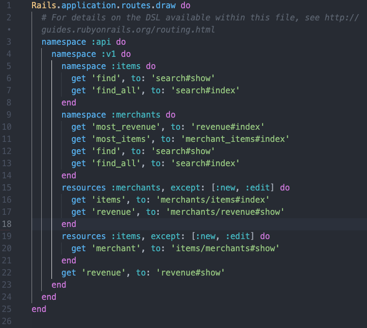

# Rails Engine: Back End Mod 3 Solo Project

## Introduction

*Rails Engine* is an API that exposes data about merchants, items, and revenue to be consumed by a a partner front end application called *Rails Driver*. This service-oriented architecture was our first foray as Turing students into creating and exposing an API. I completed it single handedly over the course of 6 long days.  

The project first required us to create a Rake Task to seed our database using data from 6 CSV files provided. Once that was accomplished, including setting up our models and migrations along with unit tests, we dove into creating API Endpoints. Though we were provided with the required URIs, it was our responsibility to create ReSTful routes. This proved to be a fun challenge, as well as creating services to support controller actions and carry out the bulk of the database calls.

All endpoints return JSON data which is compliant with the JSON API spec through the use of serializers. Furthermore, all endpoints are exposed under an `api` and `v1` namespace, and tested at the feature and unit level.

In addition to `index`, `show`, `create`, `update`,  and `destroy`, both Merchant and Item also have `find_all` and `find` endpoints which are namespaced in the appropriate SearchController with `index` and `show` functions corresponding to the aforementioned endpoints. There are also 2 relationship endpoints showing a particualar merchant's items and a specified item's merchant. Finally there are 4 "business intelligence" endpoints. These were the most challenging and most interesting to complete, from the required ActiveRecord to the decision on how to organize and name controllers and services.

## Tech Stack

 - Ruby 5.1.7
 - Rails 5.2.4.3
 - PostgreSQL
 - Gems
   * [Fast JSON API](https://github.com/Netflix/fast_jsonapi)(Thanks Netflix!)
   * [Money](https://github.com/RubyMoney/money)
   * [Rack CORS Middleware](https://github.com/cyu/rack-cors)
   * [Factory Bot](https://github.com/thoughtbot/factory_bot_rails)
   * [Faker](https://github.com/faker-ruby/faker)

## Schema

## Routes + Results

### Merchants Endpoints
`GET /api/v1/merchants`

 - returns all merchants

`POST /api/v1/merchants`

 - creates a new merchant by passing required params

`GET /api/v1/merchants/:id`

 - returns a specified merchant

`PATCH /api/v1/merchants/:id`

 - updates a merchant by passing required params 

`PUT /api/v1/merchants/:id`

 - updates a merchant by passing required params 

`DELETE /api/v1/merchants/:id`

 - deletes a merchant

`GET /api/v1/merchants/find?{attribute}={value}`

 - finds a single merchant based on query params
 - can search with multiple query params by adding `&{attribute}={value}`

`GET /api/v1/merchants/find_all?{attribute}={value}`

 - finds all merchants matching query params
 - can search with multiple query params by adding `&{attribute}={value}`

### Items Endpoints
`GET /api/v1/items` 

 - returns all items

`POST /api/v1/items`

 - creates a new item by passing required params

`GET /api/v1/items/:id`

 - returns a specified item

`PATCH /api/v1/items/:id`

 - updates an item by passing required params

`PUT /api/v1/items/:id`

 - updates an item by passing required params

`DELETE /api/v1/items/:id`

 - deletes a merchant

`GET /api/v1/items/find?{attribute}={value}`

 - finds a single item based on query params
 - can search with multiple query params by adding `&{attribute}={value}`

`GET /api/v1/items/find_all?{attribute}={value}`

 - finds all items matching query params
 - can search with multiple query params by adding `&{attribute}={value}`

### Relationship Endpoints
`GET /api/v1/merchants/:merchant_id/items`

 - returns a list of all the items sold by the specified merchant

`GET /api/v1/items/:item_id/merchant`

 - returns the merchant that sells the specified item

### Business Intelligence Endpoints
`GET /api/v1/merchants/most_revenue?quantity={number}`

 - returns the specified number of merchants ranked by their total revenue

`GET /api/v1/merchants/most_items?quantity={number}`

 - returns the specified number of merchants ranked by how many items they have sold total

`GET /api/v1/revenue?start={yyyy-mm-dd}&end={yyyy-mm-dd}`

 - returns the collective revenue for all merchants between the dates given

`GET /api/v1/merchants/:merchant_id/revenue`

 - returns the total revenue for the specified merchant
 
 
 ## Self Assessment 
 
 ### Demonstration of Functional Completeness 
 
 This application passes all the tests in the Rails Driver spec harness, though there is one detail that I struggled with. It appears that the way that I parsed the unit_price data from the CSV files introduced some errors. I decided to write a method to convert cents to dollars and call it in the necessary models as a `before_save` action. At first I thought I was really clever, but when I started running the spec harness I found that the unit prices were not converting correctly. I wrote a whole bunch of code to try and fix the problem, but it turned into a game of whack-a-mole; one fix would break something else. I realize now that I should have thought through the instructions regarding importing and converting unit_prices; because I used a before_save action in the model, every user created item will now also be subject to this method. I could have gone back and refactored the Rake Task to fix this error, but I decided to leave it in for a few reasons. 1) It is not necessarily an error, just because it doesn't pass the spec harness. Maybe users will need to be given guidance on the way that currency is converted. 2) It gave me an opportunity to implement a module in a rails application for the first time, which I'll talk about in the next section. 3) At this phase of the game I think it is more import to be open about mistakes and share what I've learned, rather than submit to the instinct to hide them.
 
 Aside from this minor detail, the functionality is complete and I was able to successfully hook up the Rails Engine to the Rails Driver and view the driver on local host with all the data seeded to my database. 
 
 ### Technical Quality and Organization of Code 
 
 I put a lot of energy into this aspect of the project and thoroughly enjoyed having the freedom to decide how I thought it best to organize my files and name my variables and methods. In the routes, I utilized namespacing to keep everything clear and tidy, and my controller file structure reflects the nesting closely. 
 
  
 
 Though I had originally created a folder for POROs, I decided to shift to using services because it seemed to more accurately reflect the responsibilites of these classes. I created 3 services which make database calls and parse data on behalf of the controller. I chose not to put these in models because they didn't neatly fit into a single model and I wanted to reserve this folder for models that actually exist in the database. The services are `MerchantItems`, `MerchantRevenue` and `Search`. The latter was especially satisfying because originally I had an `ItemSearch` and `MerchantSearch` that were nearly identical. By passing in the class name as an attribute I was able to make this service more dynamic. In the future, if a search for invoice or transaction was needed, it would be easy to create. On the downside, the search method relies heavily on Ruby instead of ActiveRecord and I will be addressing that in the final section. 
 
 Another aspect of organization and abstraction has to do with creating serializers. I used Fast JSON API to create serializers for the Merchant and Item classes, but a few of the business intelligence endpoints required a specialized serializer that didn't include an id. For this, I created a serializer from scratch, and was able to pass it just the params (revenue) without an object. 
 
 I was excited to try and use a module in this project, and inheritance if possible. I wasn't able to find an opportunity for inheritance, but I did create a module to contain the crazy methods I wrote to convert cents to dollars. I had originally tried to use a module to remove the repetition from the search services, but upon creation I realized that I no longer needed two separate searches anyways and just replaced them with one more dynamic service. The module for converting dollars to cents is called Dollarable and is located in `lib/assets` which Ian (instructor) indicated is the appropriate location since we could potentially recycle a module housed in this location and use it in other ruby or rails projects. This instruction helped me understand that our modules should be so dynamic that we could plop them in another project and they would still work. Mind. Blown. 
 
 ### Identifying Code for Future Refactor 
 
 Dollar conversion aside, there are other refactors that I think would take priority. The way that I am accomplishing the search isn't as polished as I would like. I am using a lot of Ruby, and at least in some of these places I think I could be using ActiveRecord. Furthermore, I am still unclear on the constraints of the search and I would appreciate spending some time gaining a better understanding of the expectations, and also downsides of various implementations. 
 
 Another area for refactor is the Merchant Revenue Service. There is some repetition in the methods and I suspect that helper methods could DRY up this code and improve reusability. I also suspect that I am making a number of superfluous database calls. In particular, I think there are instances where I am returning a merchant_id to the controller and then using it to find a Merchant, rather than returning the merchant object. This would be a priority to investigate and remedy. 
 
 ### Test Coverage 
 
 According to SimpleCov test coverage is 100%, but I know better. The spec harness was both a help and a hinderance. The instructions for this assignment were at times vague and confusing, and I came to rely on the spec harness to point me in the right direction. Therefore, I was less inclined than I might otherwise be to wander down every possible sad path once I knew that the spec harness was passing. In some cases, tests which were not thorough enough were replaced with versions based on the spec harness. In short, it was hard to write thorough tests because I didn't always understand what was being asked of me. Nevertheless, I made an effort to write tests for every model method and service, along with feature tests for every endpoint, even if they area not as specific as they probably could be. 
 
 On a lighter note, this project was my first foray into Factory Bot and Faker and I am in love. These tools were designed to make developers happy, just like Ruby, and I find that so inspiring! I would definitely like to contribute to Faker in the future, or create something similar.
 
 ### Approach to ActiveRecord queries 
 
 It was fun to get back into ActiveRecord, especially considering I wasn't nearly as frustrated as I was last mod trying to write more advanced queries. I was able to anticipate that `.group` would return a Hash and `.where` and `.pluck` return Arrays. I did however struggle a lot with when to make the table name plural, which I guess is just a part of learning rails. 
 
 As I said above, I am still learning to recognize when I am making unnecessary database calls and I hope this will come more naturally as I continue to learn. I also recognized during this project that polymorphism could be implemented in repetitive ActiveRecord queries, and repeated chunks of code could be pulled out and aliased in helper methods. I wasn't able to follow through with this, but I will keep an eye out for examples I could emulate in my own code.  
 
 For the revenue methods, I decided to create a column in the invoice_items table for total, and populated it with the result of multiplying the unit_price by the quantity. Needing this data over and over again, it seemed to be totally helpful and not at all harmful, but I still would like confirmation that there aren't any unforseen downsides to this approach. 
 
 Overall, I would say that because of my dependence on Ruby in the search service, I am disappointed in my ActiveRecord in this project.
